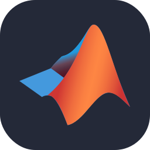

### I'm Horace
- 🙈: 24年新晋互联网小牛马，喜欢coding，喜欢交友～
- 🖥 技能：擅长Java、Golang、Python语言的开发
- 🌈 博客：[沈自在的笔记屋](https://www.szz.tax)
- 🐳 作品：目前还咩有很好的作品，等我努力吧💪
- 📺 Bilibili：[_沈自在](https://space.bilibili.com/565772576?)

### My favorite tools and technologies ⚙️
> Tools and technologies that I have worked with and am interested in
<table>
  <tr>
    <td align="center" width="96">
        
       Java
    </td>
    <td align="center" width="96">
      
       Python
    </td>
    <td align="center" width="96">
        
       Javascript
    </td>
    <td align="center" width="96">
        
       K8s
    </td>
       <td align="center" width="96">
        
       Django
    </td>
       <td align="center" width="96">
        
       Github
    </td>
          <td align="center" width="96">
        
       Rest API
    </td>
          <td align="center" width="96">
        
       Docker
    </td>
    <td align="center" width="96">
        
       Nginx
    </td>
  </tr>
  <tr>
    <td align="center" width="96">
        
       Git
    </td>
    <td align="center"  width="96">
        
       GitLab
    </td>
    <td align="center"  width="96">
        
       HTML
    </td>
    <td align="center" width="96">
        
       CSS
    </td>
    <td align="center"  width="96">
        
       VueJs
    </td>
    <td align="center" width="96">
        
       Golang
    </td>
        <td align="center" width="96">
        
       ElasticSearch
    </td>
        <td align="center" width="96">
        
       MySql
    </td>
            <td align="center" width="96">
        
       Gradle
    </td>
  </tr>
   <tr>
    <td align="center" width="96">
        
       Redis
    </td>
        <td align="center" width="96">
        
       Postman
    </td>
            <td align="center" width="96">
        
       Linux
    </td>
    <td align="center" width="96">
        
       Kafka
    </td>
    <td align="center" width="96">
        
       RabbitMQ
    </td>
    <td align="center" width="96">
        
       Lua
    </td>
    <td align="center" width="96">
        
       GraphQL
    </td>
    <td align="center" width="96">
        
       Kotlin
    </td>
    <td align="center" width="96">
        
       Matlab
    </td>
  </tr>
 <tr>
 </tr>
</table>

### Github stats 📊

### Final 📷

